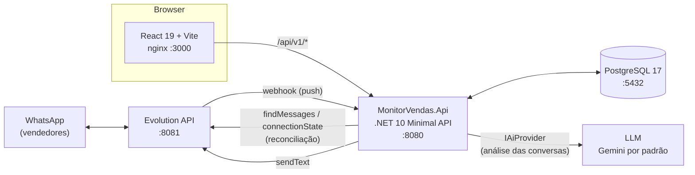
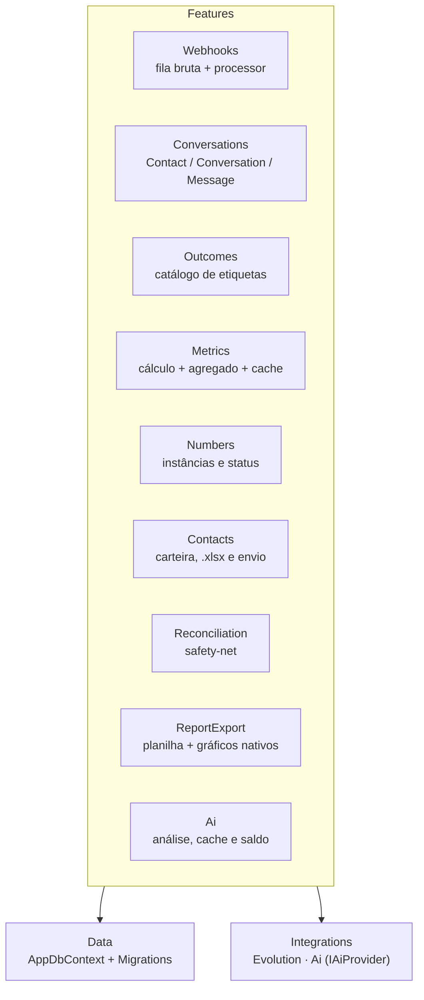
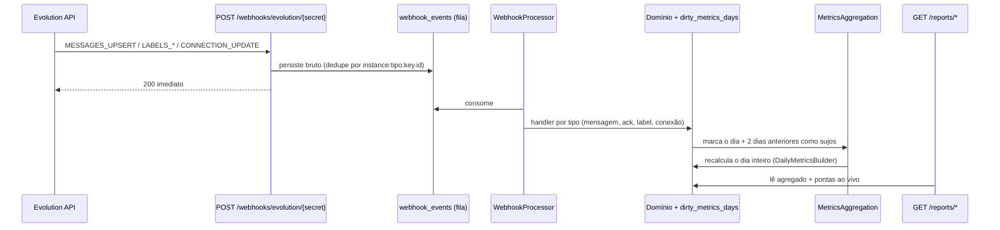

# Monitor de Vendas

Painel de acompanhamento de desempenho de vendedores que atendem clientes pelo
WhatsApp. O sistema lê as conversas em tempo real pela [Evolution API](https://doc.evolution-api.com/),
transforma cada mensagem em métrica de atendimento (tempo de resposta,
follow-up, conversão) e entrega o resultado em um dashboard com ranking do time,
relatório por vendedor, exportação da carteira de clientes e um relatório em
Excel com leitura das conversas feita por LLM.

<p>
  
  
  
  
  
  
</p>

---

## Índice

- [O problema](#o-problema)
- [Funcionalidades](#funcionalidades)
- [Arquitetura](#arquitetura)
- [Pipeline de dados](#pipeline-de-dados)
- [Como as métricas são calculadas](#como-as-métricas-são-calculadas)
- [Relatório em Excel com análise por IA](#relatório-em-excel-com-análise-por-ia)
- [Tecnologias](#tecnologias)
- [Como rodar](#como-rodar)
- [Configuração](#configuração)
- [API](#api)
- [Estrutura do repositório](#estrutura-do-repositório)
- [Testes](#testes)
- [Decisões de projeto](#decisões-de-projeto)

---

## O problema

Uma operação de vendas por WhatsApp não tem visibilidade nenhuma por padrão. O
gestor não sabe quanto tempo o cliente esperou por uma resposta, quantas
conversas ficaram sem retorno, quem faz follow-up e quem não faz — e o WhatsApp
Business não exporta nada disso.

O Monitor de Vendas fecha essa lacuna sem mudar o jeito de trabalhar do
vendedor: ele continua atendendo no WhatsApp normalmente, e o desfecho de cada
conversa é marcado com as **etiquetas nativas do WhatsApp Business**. Não existe
"cadastrar venda no sistema" — a etiqueta é o registro.

Três regras dão o tom do produto:

- **Tempo é tempo útil.** Todo relógio de métrica roda em horário comercial
  (seg–sex 9h–18h, sábado 9h–13h configurável, feriados cadastráveis). Cliente
  que mandou mensagem 22h de sexta e foi respondido 9h05 de segunda esperou
  5 minutos, não 59 horas.
- **Canal fora do ar não pune o vendedor.** Quando um número é banido ou
  desconecta, esse intervalo é descontado do relógio.
- **A regra vive num lugar só.** O mesmo `MetricsCalculator` alimenta o cálculo
  ao vivo e a tabela agregada — não existe uma segunda implementação em forma de
  delta para divergir com o tempo.

## Funcionalidades

| | |
|---|---|
| **Dashboard do time** | KPIs agregados e gráficos de ranking empilháveis, com escolha de métrica por gráfico, layout (lista/grade) e colunas — tudo persistido no navegador |
| **Relatório por vendedor** | Os mesmos índices abertos por vendedor, com comparativo entre os números dele |
| **Múltiplos números por vendedor** | 1 número = 1 instância da Evolution. Conexão por QR code na tela, histórico do número banido continua contando para o vendedor |
| **Desfechos configuráveis** | Catálogo de tipos (`Vendas`, `Clientes perdidos`, `Aguardando pagamento`, …) mapeados para etiquetas do WhatsApp. **Tipo novo não exige migração nem deploy** |
| **Retroatividade** | Toda associação etiqueta↔conversa é registrada; mudar o catálogo reavalia o histórico e refaz os dias afetados |
| **Carteira de clientes** | Lista com uma linha por contato (não por conversa), filtros por período/vendedor/desfecho/banimento e exportação `.xlsx` |
| **Envio da lista por WhatsApp** | A mesma lista mandada como mensagem (`Nome - 5511999998888`), quebrada em blocos numerados e enviada com intervalo entre mensagens |
| **Relatório em Excel** | As métricas do painel em planilha, com **gráficos nativos** ligados às células (não imagem) e escolha de quais métricas entram |
| **Análise por IA** | Um LLM lê as conversas e classifica o desfecho, expondo a coluna **Divergência** (IA ≠ etiqueta) — é ela que revela etiquetagem esquecida |
| **Saldo de IA em reais** | Teto de gasto por janela, com reserva antes da chamada e acerto pelo consumo real. Estimativa de custo aparece na tela antes de confirmar |
| **Feriados e horário comercial** | Cadastro de feriados que zeram o dia no relógio útil e disparam o reprocessamento automático |
| **Atualização sem refresh** | Polling configurável (1/5/10 min ou desligado) com indicador de última busca e botão de atualização manual |
| **Celular** | Apresentação própria abaixo de 768px — navegação por barra inferior, tabelas em cards, diálogos como folha inferior e alvos de toque. Mesmas telas e funcionalidades; a versão de PC não muda |

## Arquitetura

Monorepo com dois projetos independentes — `server/` (API) e `client/`
(front-end) — orquestrados por um único `docker-compose.yml`.



O servidor é **um projeto único organizado por feature** (vertical slices), não
em camadas. Cada pasta em `Features/` carrega suas entidades EF, seus endpoints
e sua regra de negócio:



Não há controllers, mediator nem camada de aplicação: um endpoint é um
`MapGet`/`MapPost` registrado por um extension method da própria feature sobre o
grupo versionado (`/api/v1`).

## Pipeline de dados

A coleta é **push-first**: o webhook é a via primária e a reconciliação existe
só como rede de segurança.



1. **Recepção.** O webhook é autenticado por um secret no path, gravado **bruto**
   em `webhook_events` e respondido com 200 na hora. Nada de regra de negócio no
   caminho da requisição.
2. **Processamento.** O `WebhookProcessor` (BackgroundService) consome a fila e
   despacha por tipo via `IWebhookEventHandler`. Falha incrementa `Attempts`
   (máx. 5) sem travar os eventos seguintes.
3. **Reconciliação.** Opcional, compara `connectionState` e `findMessages` da
   Evolution com o banco e **sintetiza WebhookEvents** para o que faltou — mesmo
   pipeline, mesma idempotência, zero código duplicado.
4. **Agregação.** O pipeline nunca calcula métrica: ele só **marca o dia como
   sujo**. Um serviço em background recalcula os dias marcados reusando o mesmo
   calculador do caminho ao vivo. Refazer o mesmo dia dá o mesmo resultado.

### A regra "última etiqueta vence"

O desfecho de uma conversa é sempre **derivado**, nunca escrito à mão. Toda
associação de etiqueta é registrada com `AppliedAt`/`RemovedAt` (mesmo as não
mapeadas), e o desfecho vigente é o da etiqueta mapeada ativa mais recente.
Remover a vencedora faz a anterior voltar a valer. Uma conversa tem no máximo um
desfecho, e o histórico completo é o que permite reavaliar o passado quando o
catálogo muda.

A comparação é por **chave normalizada** (minúsculas, sem acento, sem emoji ou
pontuação): `"Fechado ✅"` casa com `fechado`. Mas `venda` **não** casa `vendas`
nem `venda cancelada` — cada variação é cadastrada explicitamente, porque adivinhar
plural aqui erraria em silêncio.

## Como as métricas são calculadas

A leitura de relatório tem **três camadas**, escolhidas pelo tamanho do período:

| Camada | Quando entra | O que faz |
|---|---|---|
| **Cálculo ao vivo** | períodos ≤ 7 dias (`Metrics:LiveCalculationMaxDays`) | 6 queries no total, independentemente da quantidade de números — carga em lote e agrupamento em memória, sem N+1. Mediana **exata** |
| **Agregado diário** | períodos maiores | soma os dias fechados de `DailyNumberMetrics` e calcula ao vivo só as pontas parciais. Buraco no agregado é detectado, calculado em blocos contíguos e marcado como sujo |
| **Cache de resposta** | `Metrics:CacheSeconds` > 0 | várias abas no mesmo minuto custam um cálculo só. `Cache-Control: no-cache` (botão de atualizar) recalcula |

**Ganho medido** com 28.800 mensagens / 10 vendedores × 2 números × 90 dias:
**718 ms → 174 ms** (eliminando o N+1) **→ 74 ms** (agregado). A carteira de
clientes teve o mesmo tratamento: prévia em **110 ms** e exportação completa de
3.600 contatos em **534 ms** (era 1.921 ms). Os benchmarks são reproduzíveis:

```bash
dotnet test --filter "Category=benchmark" --logger "console;verbosity=detailed"
```

### Grandezas somáveis vs. não somáveis

Contagens, somas, mín/máx e horas úteis somam entre dias sem perda. **A mediana
da 1ª resposta não soma** — por isso o agregado guarda um **histograma**
(faixas estreitas até 30 min, larga na cauda) e estima a mediana por
interpolação. Períodos curtos, calculados ao vivo, entregam a mediana exata.

### Índices disponíveis

Conversas iniciadas / atendidas / **não respondidas** · taxa de resposta ·
**disparos** (conversas iniciadas pelo vendedor) e **captações** (disparos que
tiveram resposta) · mediana da 1ª resposta · espera mín/máx/média sobre toda
mensagem respondida · enviadas/recebidas + razão + médias por hora útil · taxa
de leitura · **follow-up** (silêncios resgatados ÷ silêncios — conta cada
silêncio, não a conversa) · vendas e demais desfechos por tipo · conversão ·
tempo até fechar · última mensagem enviada · uptime % e contagem de bans.

## Relatório em Excel com análise por IA

As métricas do painel viram uma planilha, e um LLM lê as conversas para dizer o
que ele acha que aconteceu em cada uma. O dialog "Exportar Excel" no dashboard
dispara o job; o arquivo fica pronto em background.

| Aba | Conteúdo |
|---|---|
| `Resumo` | totais do time, pelas mesmas regras da tela |
| `Ranking` | uma linha por vendedor, com as métricas escolhidas |
| `Gráficos` | gráficos **nativos** do Excel, ligados às células da aba `Ranking` |
| `Por número` | abertura por número de WhatsApp |
| `IA — Conversas` | classificação do modelo por conversa + coluna **Divergência** |
| `IA — Vendedores` | síntese por vendedor, feita sobre os resumos |

Três decisões sustentam a feature:

- **Nenhuma métrica é recalculada aqui.** O writer consome o mesmo
  `ReportQueries` da tela — cache, agregado e horário comercial inclusos. Um
  cálculo próprio divergiria da tela sem ninguém perceber.
- **A etiqueta é a verdade; a IA é auditoria.** Conversão, vendas e ranking nunca
  olham para o modelo. A leitura dele fica confinada às duas abas de IA, e a
  coluna **Divergência** (IA ≠ etiqueta) é o produto de verdade: ela mostra onde
  o vendedor esqueceu de etiquetar.
- **Saldo estourado não invalida o arquivo.** A planilha sai com o que deu, e as
  conversas restantes aparecem com "Saldo de IA insuficiente" na coluna
  Observação. Aqui meia planilha é melhor que nenhuma — ao contrário do envio de
  contatos, onde meia lista é pior.

### Gráficos nativos

ClosedXML não cria gráficos. O `.xlsx` pronto é reaberto e o chart é injetado por
OpenXML cru (`ChartInjector`), ligado às células — quem abrir o arquivo pode
mexer nos dados e ver o gráfico responder. O `<drawing>` tem posição fixa no
schema da aba (depois de `pageSetup`, antes de `tableParts`); fora de ordem o
Excel recusa o arquivo inteiro. Existe um teste com `OpenXmlValidator` para
isso: **se ele quebrar, o arquivo está corrompido**, não é rigor de schema.

### O que vai para o modelo

O `TranscriptBuilder` monta o texto enviado ao provedor e **mascara nome e
telefone do cliente** (e qualquer número com 10+ dígitos). Mídia vira rótulo
(`[áudio]`), o silêncio é informado **em horas úteis**, e conversa longa é
cortada no meio preservando o fim — é lá que mora o desfecho.

O status possível vem do **catálogo de desfechos**, não de uma lista fixa: os
tipos ativos mais o embutido `open` ("Em andamento"). Conversa parada além do gap
de follow-up **perde o `open` do próprio schema** — onde o relógio decide, ele
decide antes da IA.

Contra injeção de prompt, a transcrição vai delimitada e marcada como dado, e o
`enum` fechado do schema recusa status inventado (nova tentativa, depois linha
marcada "não analisada"). O pior caso é uma linha de auditoria errada — **nunca
uma ação no sistema**.

### Custo sob controle

- **O saldo é derivado, nunca guardado.** `ai_usages` registra os gastos e o
  saldo é `AmountPerWindow − gastos da janela corrente`. Não acumula por
  construção e não precisa de job de recarga: se a API cair na virada, na volta
  já está certo.
- **Reserva antes, acerto depois.** Uma estimativa local reserva o valor e
  bloqueia **antes** de gastar; o débito definitivo usa os tokens que o provedor
  reportou. Um `pg_advisory_xact_lock` serializa as reservas — duas exportações
  simultâneas não furam o teto.
- **Erro que impediu a geração libera a reserva; timeout depois do envio mantém
  o débito**, porque provavelmente houve cobrança do outro lado.
- **Cache por conversa** (chaveado por contagem de mensagens + última mensagem):
  conversa que não andou não é reanalisada. Reexportar o mesmo período custa
  quase zero — é a maior economia da feature.
- Modelo sem preço configurado **explode** em vez de cobrar zero: gasto sem teto
  é pior que erro alto.

### Trocar de LLM

`IAiProvider` é a fronteira. Um provedor novo é uma classe nova mais
`Ai:Provider` na config — nada do dialeto do fornecedor escapa de
`Integrations/Ai/`. Hoje há `GeminiProvider`.

> **Notas de campo do Gemini (30/07/2026):** `gemini-2.5-flash` responde 404 para
> chaves novas, então o default é `gemini-3.6-flash` — **confira o preço dele no
> painel do Google**, o valor no `appsettings` foi herdado do 2.5. Modelos 3.x
> recusam `thinkingConfig.thinkingBudget` com 400. O raciocínio sai do mesmo teto
> de `MaxOutputTokens` e domina a conta (430 tokens de pensamento para 37 de
> resposta, num caso medido). Free tier são 5 requisições por minuto por modelo —
> o 429 traz `retryDelay` e obedecê-lo é o que faz a exportação terminar.

## Tecnologias

### Back-end (`server/`)

| Tecnologia | Papel |
|---|---|
| **.NET 10 — Minimal API** | endpoints sem controllers, um projeto único por feature |
| **PostgreSQL 17 + EF Core 10 (Npgsql)** | persistência; schema por migrações, aplicadas no startup |
| **Asp.Versioning.Http** | versionamento obrigatório no segmento da URL (`/api/v1`) |
| **ClosedXML + DocumentFormat.OpenXml** | geração dos `.xlsx`; o OpenXML cru entra só para injetar os gráficos nativos |
| **`IAiProvider`** (Gemini) | análise das conversas por LLM, atrás de uma interface própria |
| **BackgroundService** | webhooks, agregação diária, reconciliação, envio de contatos e exportação do relatório |
| **xUnit + Testcontainers + Respawn** | testes de integração contra um PostgreSQL real |

### Front-end (`client/`)

| Tecnologia | Papel |
|---|---|
| **React 19 + Vite + TypeScript** (strict) | SPA |
| **Tailwind CSS v4** | tema próprio via `@theme`, sem shadcn/CLI — componentes em `components/ui.tsx`; breakpoint `md` (768px) separa a apresentação de celular da de desktop |
| **TanStack Query** | cache, polling e invalidação por mutação |
| **React Router** | Dashboard, vendedor, Cadastros, Contatos, Etiquetas, Feriados (a exportação do relatório é dialog, não rota) |
| **Recharts** | gráficos, com paleta de ordem fixa validada para contraste |
| **Vitest + Testing Library + MSW** | testes de página com HTTP mockado (`onUnhandledRequest: 'error'`) |

### Infraestrutura

`docker-compose` sobe o stack inteiro: client (nginx), API, Evolution API e
Postgres. Em produção o nginx do client faz proxy de `/api` → `api:8080`, então
front e API são a mesma origem e **não há CORS envolvido**.

## Como rodar

### Pré-requisitos

- [Docker Desktop](https://www.docker.com/products/docker-desktop/) (com Compose)
- Para desenvolvimento: [.NET SDK 10](https://dotnet.microsoft.com/download) e [Node.js 20+](https://nodejs.org/)

### Opção 1 — stack completo no Docker

```bash
git clone <url-do-repositorio> monitor-vendas
cd monitor-vendas/server
docker compose up --build
```

| Serviço | URL |
|---|---|
| Front-end | http://localhost:3000 |
| API | http://localhost:8080 |
| Evolution API | http://localhost:8081 |
| PostgreSQL | `localhost:5433` (5432 no container) |

> **Volume novo?** A Evolution usa um banco separado no mesmo Postgres. Crie-o
> antes da primeira subida:
> ```bash
> docker compose exec postgres psql -U postgres -c "CREATE DATABASE evolution;"
> ```

**Smoke test:** `GET /health` (checa o banco), `GET /api/v1/ping` e
`GET :8081/` (Evolution respondendo).

> A porta **5433** no host é proposital: a máquina de desenvolvimento tem um
> PostgreSQL local ocupando a 5432.

### Opção 2 — desenvolvimento (API e front no host)

```bash
# 1. infra
cd server
docker compose up -d postgres evolution
docker compose exec postgres psql -U postgres -c "CREATE DATABASE evolution;"

# 2. API (roda MigrateAsync no startup — o Postgres precisa estar de pé)
dotnet run --project src/MonitorVendas.Api --urls http://localhost:8080

# 3. front (proxy /api → localhost:8080)
cd ../client
npm install
npm run dev
```

Com a API rodando no host, aponte `Webhook:PublicBaseUrl` para
`http://host.docker.internal:8080` — é assim que o container da Evolution
alcança a API para entregar os webhooks.

### Primeiros passos no app

1. **Cadastros** → criar um vendedor.
2. Adicionar um número ao vendedor: a API cria a instância na Evolution, devolve
   o **QR code** no dialog e registra o webhook sozinha. Leia o QR no WhatsApp.
3. **Etiquetas** → conferir o catálogo de desfechos. `Vendas` e
   `Clientes perdidos` já vêm semeados; a tela sugere as etiquetas que existem
   nos WhatsApps conectados e ainda não estão mapeadas.
4. **Feriados** → cadastrar os feriados do ano (zeram o dia no relógio útil).
5. Conversar. As métricas aparecem no dashboard conforme os webhooks chegam.
6. **Dashboard → "Exportar Excel"** para levar o relatório para fora. Com a
   `Ai:ApiKey` configurada, a opção "Incluir análise por IA" mostra o custo
   estimado e o saldo antes de você confirmar.

> Não há backfill: o monitoramento vale **daqui para frente**.

### Comandos

| | Back-end (`server/`) | Front-end (`client/`) |
|---|---|---|
| Build | `dotnet build MonitorVendas.slnx` | `npm run build` (inclui type-check) |
| Testes | `dotnet test MonitorVendas.slnx` | `npm test` |
| Rodar | `dotnet run --project src/MonitorVendas.Api` | `npm run dev` |
| Lint | — | `npm run lint` |

Nova migração:

```bash
dotnet ef migrations add <Nome> \
  --project src/MonitorVendas.Api \
  --startup-project src/MonitorVendas.Api \
  -o Data/Migrations
```

> `--startup-project` não é opcional: sem ele o CLI tenta buildar o `.dcproj` do
> Container Tools e falha.

## Configuração

Tudo por `appsettings.json` ou variáveis de ambiente (`Secao__Chave`).

| Seção | Chaves principais |
|---|---|
| `ConnectionStrings:Postgres` | string de conexão |
| `Evolution` | `BaseUrl` (**com barra final**), `ApiKey` |
| `Webhook` | `Secret`, `PublicBaseUrl`, `ProcessorEnabled`, `ProcessorIntervalSeconds` |
| `Metrics` | `TimeZone`, horas úteis seg–sex, `SaturdayEnabled`/`SaturdayStartHour`/`SaturdayEndHour`, `NewConversationWindowDays` (15), `AnswerWindowBusinessHours`, `FollowUpGapBusinessHours`, `CacheSeconds`, `AggregationEnabled`, `AggregationIntervalSeconds`, `UseDailyAggregates`, `LiveCalculationMaxDays` (7) |
| `Reconciliation` | `Enabled` (desligado por padrão), `IntervalMinutes`, `LookbackHours` |
| `ContactShare` | `Enabled`, `IntervalSeconds`, `DelayBetweenMessagesSeconds`, `MaxCharsPerMessage`, `MaxMessagesPerShare`, `MaxAttempts` |
| `Ai` | `Provider`, `BaseUrl`, `ApiKey`, `Model`, `MaxOutputTokens`, `ThinkingBudgetTokens`, `MaxConcurrency`, `MaxAttempts`, `RetryBackoffSeconds`, `UsdBrlRate` e a tabela `Pricing` por modelo (USD por 1M tokens) |
| `AiBudget` | `Enabled`, `AmountPerWindow` (R$), `WindowHours` (máx. 24), `MarginPercent` |
| `ReportExport` | `Enabled`, `IntervalSeconds`, `RetentionHours`, `MaxConversationsPerExport` |
| `Cors:AllowedOrigins` | lista de origens; vazia em Development libera qualquer origem |

### Chave da IA

Em desenvolvimento, `Ai:ApiKey` vem do **user-secrets** — nunca do
`appsettings.json`:

```bash
cd server/src/MonitorVendas.Api
dotnet user-secrets set "Ai:ApiKey" "sua-chave"
```

Em Docker ou produção o cofre não existe: use a variável de ambiente
`Ai__ApiKey`.

> A janela do saldo é ancorada na meia-noite do `Metrics:TimeZone`, então o
> horário de recarga é previsível. `AiBudget:Enabled=false` não bloqueia nada mas
> **continua registrando** o gasto — desligar o freio não pode cegar o histórico.

Todo `DateTime` persistido é **UTC** (`timestamptz`). A conversão para
`Metrics:TimeZone` acontece só dentro do `BusinessHoursCalendar` e na saída de
datas para a planilha.

> Mudou horário comercial ou timezone? Rode
> `POST /api/v1/reports/rebuild?from&to` para reprocessar o intervalo afetado.
> Cadastro e remoção de feriado já disparam o rebuild de ±3 dias sozinhos.

## API

Todas as rotas sob `/api/v1`. **Não há autenticação** — decisão explícita do
produto (ver [Decisões de projeto](#decisões-de-projeto)).

| Recurso | Rotas |
|---|---|
| Vendedores | `POST`/`GET`/`PUT` `/sellers` |
| Números | `POST`/`GET` `/sellers/{id}/numbers` · `GET /numbers` · `POST /numbers/{id}/connect` (novo QR) · `POST /numbers/{id}/ban-permanent` |
| Webhooks | `POST /webhooks/evolution/{secret}` |
| Desfechos | `GET`/`POST`/`PUT`/`DELETE` `/outcome-types` (+ `/{code}/terms`) · `GET /outcome-labels/suggestions` |
| Contatos | `GET /contacts` (prévia paginada) · `GET /contacts/export` (`.xlsx`) · `POST /contacts/share` · `GET /contacts/share/{id}` |
| Feriados | `POST`/`GET`/`DELETE` `/holidays` |
| Relatórios | `GET /reports/sellers/{id}?from&to` · `GET /reports/ranking?from&to` · `POST /reports/rebuild?from&to` |
| Exportação do relatório | `GET /reports/export/metrics` (métricas e gráficos disponíveis) · `POST /reports/export/estimate` (custo de IA) · `POST /reports/export` (202) · `GET /reports/export/{id}` · `GET /reports/export/{id}/file` |
| IA | `GET /ai/budget` (saldo da janela corrente) |
| Saúde | `GET /health` · `GET /api/v1/ping` |

### Carteira de clientes

`GET /contacts` e `GET /contacts/export` aceitam **os mesmos filtros** —
a planilha é sempre exatamente o que está na tela:

| Filtro | Efeito |
|---|---|
| `from` / `to` | o contato entra se teve mensagem no período, e as colunas consideram só esse intervalo |
| `sellerId` | restringe as conversas consideradas — a linha passa a refletir aquele vendedor |
| `outcomeTypes` | códigos separados por vírgula; `none` = sem desfecho |
| `banned` | `true`/`false`, avaliado sobre o número responsável |

É **uma linha por contato**, não por conversa: um cliente que falou com dois
vendedores sai uma vez só, com os dados do atendimento mais recente do período.
Acima de 50.000 linhas a resposta traz `X-Truncated: true`.

### Envio da lista por WhatsApp

O conteúdo é **congelado no pedido**: `POST /contacts/share` monta as mensagens e
grava no banco; o serviço em background não reconsulta nada — o que chega ao
destinatário é o que foi confirmado na tela. Uma falha registra a tentativa e
**para o envio inteiro** (metade da lista é pior que nada); a passada seguinte
retoma de onde parou.

### Exportação do relatório

Mesmo molde: `POST /reports/export` grava os filtros **congelados** e responde
**202**; o job monta a planilha em background e guarda os bytes na própria linha,
apagados depois de `RetentionHours` (planilha é descartável, não merece volume no
compose). A tela acompanha por polling e baixa em `/file`.

Como a etapa de IA é longa, o job publica em que **fase** está ("Analisando
conversas", "Sintetizando vendedores") — sem isso a exportação parece travada
justamente quando está fazendo o trabalho mais caro.

`GET /reports/export/metrics` alimenta os filtros — **tipo de desfecho novo vira
coluna e opção de gráfico sem uma linha de código no front**.

## Estrutura do repositório

```
monitor-vendas/
├── client/                                 # SPA React 19 + Vite
│   ├── src/
│   │   ├── api/                            # types.ts (espelho dos DTOs), client.ts, queries.ts (hooks)
│   │   ├── components/                     # Layout (sidebar), ui.tsx, KpiCard
│   │   ├── features/
│   │   │   ├── dashboard/                  #   KPIs do time + gráficos de ranking empilháveis
│   │   │   ├── sellers/                    #   relatório do vendedor + comparativo por número
│   │   │   ├── registry/                   #   CRUD de vendedores e números (QR, ban)
│   │   │   ├── contacts/                   #   carteira, exportação e ShareDialog
│   │   │   ├── reports/                    #   ExportReportDialog: filtros, custo de IA e polling do job
│   │   │   ├── labels/                     #   tipos de desfecho, termos e sugestões
│   │   │   └── holidays/                   #   cadastro de feriados
│   │   ├── lib/                            # format, palette, polling, usePersistedState, metrics
│   │   └── test/                           # setup, handlers MSW, render com providers
│   └── CLAUDE.md                           # convenções do front
│
└── server/
    ├── MonitorVendas.slnx                  # solution no formato novo do SDK 10
    ├── docker-compose.yml                  # client + api + evolution + postgres
    ├── src/MonitorVendas.Api/
    │   ├── Program.cs                       # composição DI + MigrateAsync no startup
    │   ├── Dockerfile                       # multi-stage
    │   ├── Features/
    │   │   ├── Sellers/                     #   vendedores
    │   │   ├── Numbers/                     #   WhatsappNumber, status, ban, conexão
    │   │   ├── Webhooks/                    #   fila bruta, processor, IWebhookEventHandler
    │   │   ├── Conversations/               #   Contact, Conversation, Message, labels, parsing
    │   │   ├── Outcomes/                    #   catálogo, normalizador, resolver, reconciler
    │   │   ├── Contacts/                    #   queries, endpoints, .xlsx e envio por WhatsApp
    │   │   ├── ReportExport/                #   job, writer, AiSheetsWriter, ChartInjector, TeamTotals
    │   │   ├── Ai/                          #   saldo em reais (AiUsage/AiBudget) e endpoint
    │   │   │   └── Analysis/                #     transcrição mascarada, schema fechado, cache, síntese
    │   │   ├── Reconciliation/              #   safety-net contra webhook perdido
    │   │   └── Metrics/                     #   calculador, agregado diário, cache, feriados
    │   ├── Data/                            # AppDbContext, Configurations, Migrations
    │   ├── Integrations/Evolution/          # HTTP client da Evolution API
    │   ├── Integrations/Ai/                 # IAiProvider, custo, opções; Gemini/
    │   └── Common/                          # versionamento de API, datas UTC
    ├── tests/MonitorVendas.Tests/           # xUnit + Testcontainers + Respawn
    └── CLAUDE.md                            # domínio, decisões e convenções do back
```

Os dois `CLAUDE.md` são a documentação profunda do projeto e acompanham o código
— sempre que a estrutura, uma convenção ou um workflow muda, eles mudam no mesmo
commit.

## Testes

```bash
cd server && dotnet test MonitorVendas.slnx    # integração (sobe Postgres em container)
cd client && npm test                          # componentes e páginas
```

Os testes de back-end são **de integração de verdade**: `Testcontainers` sobe um
PostgreSQL 17 real e `Respawn` limpa o banco entre os casos. A
`IntegrationTestWebAppFactory` desliga os background services e o cache, troca a
Evolution e a IA por handlers falsos, e o pipeline é dirigido deterministicamente
(`ProcessPendingAsync()`, `RunOnceAsync()`, `ProcessDirtyDaysAsync()`) — nada de
`Thread.Sleep` esperando job. O `FakeAiHandler` roda com preço redondo
(US$ 1,00/1M tokens, câmbio 5,00, saldo de R$ 1,00 por janela): a conta de custo
do teste cabe na cabeça de quem lê.

Convenções da suíte:

- Todo teste tem um comentário de uma linha, em português, descrevendo cenário e
  comportamento esperado.
- **Bug encontrado vira teste de regressão** antes de a tarefa fechar.
- Benchmarks ficam em `Performance/` com `[Trait("Category","benchmark")]` e
  **não** rodam na suíte normal.
- O teste que não pode falhar ao mexer em métricas é
  `DailyAggregateTests.AggregatedRead_MatchesLiveCalculation`: ele garante que o
  caminho agregado e o ao vivo produzem os mesmos números.
- O teste do `ChartInjector` valida a planilha com `OpenXmlValidator` — quebrou
  ali, o `.xlsx` não abre no Excel.

## Decisões de projeto

Escolhas deliberadas, registradas aqui para não serem "corrigidas" por engano:

- **Sem autenticação.** O painel roda em rede interna. Não adicionar JWT ou API
  key sem pedido explícito.
- **Minimal API em projeto único, organizado por feature.** Nada de controllers,
  mediator ou camadas — a complexidade do projeto não paga esse custo.
- **Sem backfill.** O sistema monitora daqui para frente; a reconciliação
  recupera apenas a janela recente.
- **Grupos são ignorados.** Só conversas 1:1 (`@g.us` e `@broadcast` são
  descartados no handler).
- **Ban permanente é decisão manual.** Um `403` da Evolution marca o número como
  banido temporariamente; a reconexão o devolve para ativo.
- **O texto das mensagens é armazenado**, por decisão explícita do produto.
- **Uma mensagem enviada pelo próprio sistema não conta como atividade do
  vendedor.** O envio da lista de contatos volta pelo webhook como `fromMe`; o
  `key.id` é guardado no pedido e o handler descarta esse upsert.
- **A janela de conversa nova é de 15 dias** de silêncio no par (número, contato).
- **A IA nunca alimenta métrica.** Ela audita e aponta divergência; quem decide
  venda é a etiqueta. Nenhuma saída do modelo vira ação no sistema.
- **O saldo de IA é derivado dos gastos registrados**, não um contador que se
  incrementa. Nada de job de recarga para dessincronizar.
- **Trocar de LLM é escrever um `IAiProvider`.** Nada do dialeto do fornecedor
  pode escapar de `Integrations/Ai/`.
- **Código em inglês, conversa e documentação em português.**

---

Projeto privado, de uso interno — sem licença pública definida.
